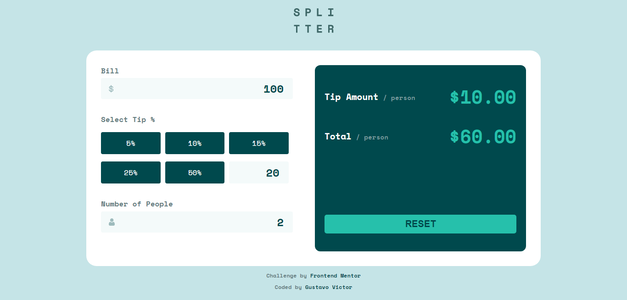
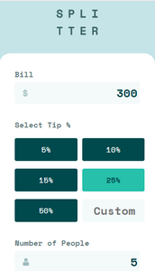
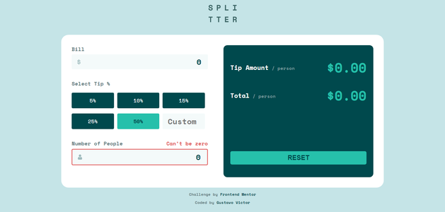

# Frontend Mentor - Tip calculator app

Este projeto é uma solução do desafio [Tip calculator app](https://www.frontendmentor.io/challenges/tip-calculator-app-ugJNGbJUX) do Frontend mentor que é  uma plataforma de desafios que te ajuda a melhorar suas habilidades de codificação e desenvolviemnto através da construção de projetos reais. 

## Tabela de conteúdos

- [Visão Geral](#-visão-geral)
  - [O desafio](#o-desafio)
  - [Screenshots](#screenshots)
  - [Links](#links)
- [Meu processo](#-meu-processo)
  - [Tecnologias](#tecnologias)
  - [Fontes](#fontes)
  - [Ferramentas](#ferramentas)
- [Autor](#-author)
- [Licença](#-licença)

## 💻Visão Geral

### O desafio

Usuários são capazes de:

- [x] Ver layout adaptado a tamanhos de tela diferentes
- [x] Ver mudanças de estado ao interagir com elementos da página
- [x] Calcular a gorjeta e o custo total da conta por pessoa

### Screenshots

 

 

### Links

- [Aplicação no Github App](https://gustavovictor.me/tip-calculator-app/)

## 🛠Meu processo

### Tecnologias

- [HTML5](https://developer.mozilla.org/pt-BR/docs/Web/HTML)
- [CSS](https://developer.mozilla.org/pt-BR/docs/Web/CSS) 
- [JS](https://www.javascript.com/)  

### Fontes

- [Space Mono (400, 700)](https://fonts.google.com/specimen/Space+Mono?query=space+mono) 

### Ferramentas

- [Visual Studio Code](https://code.visualstudio.com/)

## 🦸‍♂️Autor

- Website - [gustavovictor](http://gustavovictor.me/)
- Frontend Mentor - [@Gustavo-Victor](https://www.frontendmentor.io/profile/Gustavo-Victor)
- CodePen - [@gustavo_victor](https://codepen.io/gustavo_victor)

## 📋Licença

Este projeto está sob a licença [MIT](./LICENSE.md) 

Qualquer pessoa pode usar e contribuir com este projeto ✌

